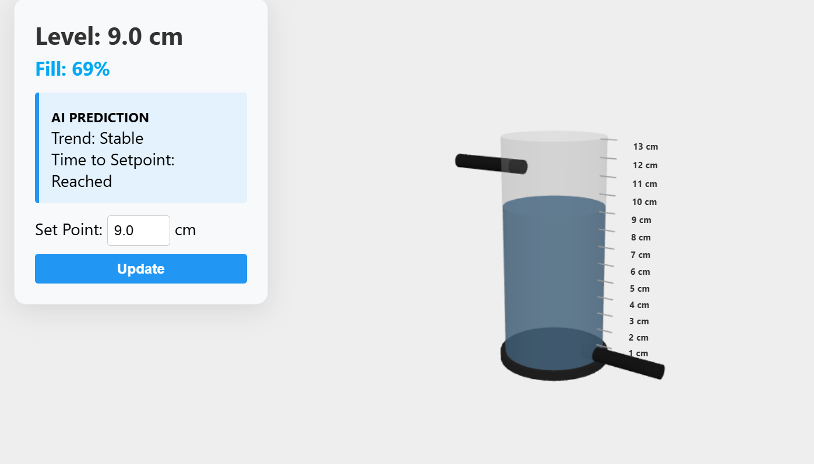

# Digital Twin Assisted Gain-Scheduled Level Control in Chemical Process Industries

## Overview

This project presents a **Digital Twin Assisted Gain-Scheduled Level Control System** for maintaining the liquid level in a cylindrical process tank used in chemical process industries. The system combines advanced process control techniques with a real-time web-based digital twin to improve monitoring, control accuracy, and user interaction.
## Web Dashboard

## Objective

The primary objective of this project is to achieve accurate and stable liquid level control in a nonlinear cylindrical tank by implementing an **Internal Model Control (IMC)-based PI controller** integrated with **gain scheduling**. The gain scheduling technique compensates for the nonlinear characteristics of the process, resulting in improved control performance across different operating conditions.

## Features

* IMC-based PI controller for robust level control.
* Gain scheduling to handle process nonlinearity and maintain consistent performance.
* Real-time monitoring and control of liquid level.
* Web-based Digital Twin with a 3D visualization of the physical process.
* Live synchronization between the physical plant and its digital twin.
* Remote setpoint adjustment through the web interface.
* Prediction of the estimated time required to reach the desired setpoint.
* Experimental validation through both simulation and practical implementation.

## Technologies Used

### Control & Automation

* IMC-Based PI Controller
* Gain Scheduling
* Process Control
* Industrial Instrumentation

### Web Technologies

* Node.js
* Three.js
* HTML
* CSS
* JavaScript

## Hardware
* Arduino UNO
* Ultrasonic Sensor
* Cylindrical Tank
* Dc pump motor
  

## Digital Twin

A web-based digital twin was developed to represent the real-world level control system in a 3D environment. The digital twin receives live process data from the physical plant, displays the current liquid level in real time, allows users to modify the desired setpoint remotely, and predicts the time required for the tank to reach the specified level.

## Project Outcome

The proposed control strategy successfully improved the linearity and stability of the nonlinear level control system. Both simulation and practical experiments demonstrated that the gain-scheduled IMC-based PI controller provides better control performance than a conventional fixed-gain controller while enabling real-time monitoring and remote operation through the digital twin.

